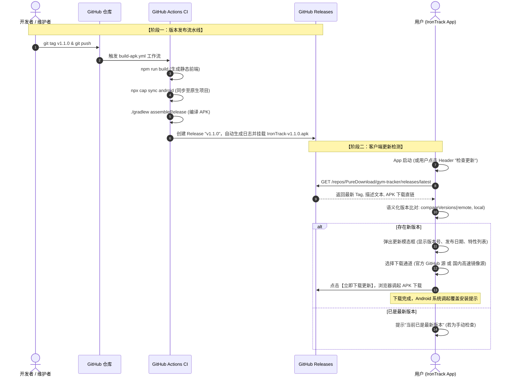

# 基于 GitHub Actions + Releases 的 Android 应用更新完整技术方案与实战指南

> **项目**：IronTrack 铁脉健身  
> **适用技术栈**：Capacitor / React / Vite / Android / GitHub Actions  
> **目标**：实现零服务器成本、全自动化构建、平滑无缝的应用内版本检测与 APK 覆盖升级系统。

---

## 目录
- [一、 背景与传统痛点](#一-背景与传统痛点)
- [二、 整体技术架构与时序设计](#二-整体技术架构与时序设计)
- [三、 CI/CD 自动化构建与发布流水线](#三-cicd-自动化构建与发布流水线)
- [四、 客户端版本检测与 SemVer 比对算法](#四-客户端版本检测与-semver-比对算法)
- [五、 国内网络环境加速下载方案](#五-国内网络环境加速下载方案)
- [六、 核心避坑：Android 签名与覆盖安装机制](#六-核心避坑android-签名与覆盖安装机制)
- [七、 进阶选型对比：全量 APK 更新 vs 前端热更新](#七-进阶选型对比全量-apk-更新-vs-前端热更新)
- [八、 快速上手与操作手册](#八-快速上手与操作手册)

---

## 一、 背景与传统痛点

在没有上架 Google Play 或国内各大应用商店（如华为、小米应用市场）的场景下，独立移动应用或开源项目通常面临以下更新痛点：
1. **服务器运维成本**：专门搭建用于存放 APK 和版本信息的后端服务器，产生额外带宽与服务器租赁费用。
2. **下载门槛高**：仅将 APK 作为 GitHub Actions 运行构件（Artifacts）保存时，用户必须在浏览器登录 GitHub 账号才能下载，且下载到的文件是 `.zip` 压缩包，移动端无法一键安装。
3. **版本更新不透明**：用户无法获知是否有新功能发布或关键 Bug 修复，导致不同用户停留在不同旧版本，带来数据兼容问题。
4. **覆盖安装失败**：由于每次 CI 打包可能产生不同签名的临时 keystore，导致用户更新时系统报错“签名不一致，无法安装”，被迫卸载重装从而丢失本地 IndexedDB/SQLite 健身数据。

**本方案的核心优势**：
- **零成本**：充分利用 GitHub Actions（免费额度）作为构建服务器，GitHub Releases 作为 CDN 资产分发节点。
- **自动化**：只需一条 `git tag v1.0.1 && git push origin v1.0.1`，云端自动编译、签名、打包、生成更新日志并上线。
- **免登录直链**：GitHub Releases 附件拥有全球公开且永久的下载直链。
- **网络鲁棒**：集成国内开源加速镜像智能切换，保障弱网或网络受限环境下的高速下载。

---

## 二、 整体技术架构与时序设计

整个更新系统分为三层：
1. **持续交付层 (CI/CD)**：GitHub Actions 监听 Git Tag 事件，编译 Web 前端与 Android Gradle，构建出 Release APK，挂载至 GitHub Releases。
2. **分发服务层 (Storage & API)**：GitHub 官方 REST API (`/repos/{owner}/{repo}/releases/latest`) 提供元数据；Release Assets 提供安装包文件；配合国内代理镜像（如 `ghproxy.net`）保障下载体验。
3. **客户端呈现层 (App)**：React 前端通过非侵入式后台静默检测，比对本地 SemVer 与远端版本，弹出暗黑赛博风格的更新面板，引导用户一键下载更新。

### 交互时序图



---

## 三、 CI/CD 自动化构建与发布流水线

### 1. 流水线配置文件：`.github/workflows/build-apk.yml`

通过使用 `softprops/action-gh-release@v2`，我们在 Gradle 打包成功后自动完成版本发布：

```yaml
name: 自动构建与发布 Android APK

on:
  push:
    branches: [ main, master ]
    tags:
      - 'v*' # 触发标签：如 v1.0.0, v1.0.1, v2.0.0
  workflow_dispatch: # 支持网页手动一键触发

permissions:
  contents: write # 必须赋予 write 权限以便 Action 创建 Release

jobs:
  build-and-release:
    name: 编译 Android APK 并发布 Release
    runs-on: ubuntu-latest

    steps:
      - name: 检出源码
        uses: actions/checkout@v4

      - name: 配置 Node.js 环境
        uses: actions/setup-node@v4
        with:
          node-version: 22
          cache: 'npm'

      - name: 配置 Java JDK 21
        uses: actions/setup-java@v4
        with:
          distribution: 'temurin'
          java-version: '21'

      - name: 配置 Android SDK
        uses: android-actions/setup-android@v3

      - name: 配置 Gradle 构建缓存
        uses: gradle/actions/setup-gradle@v4

      - name: 安装前端依赖
        run: |
          npm ci || npm install

      - name: 编译前端静态产物并同步至 Capacitor
        run: |
          npm run build
          npx cap sync android

      - name: 执行 Gradle 命令行编译
        run: |
          cd android
          chmod +x gradlew
          ./gradlew assembleDebug --no-daemon --stacktrace

      - name: 提取版本号并重命名 APK
        id: apk_info
        run: |
          VERSION="${{ github.ref_name }}"
          if [ "${{ github.event_name }}" = "workflow_dispatch" ] || [[ ! "$VERSION" =~ ^v ]]; then
            VERSION="v1.0.0-build-${{ github.run_number }}"
          fi
          APK_NAME="IronTrack-${VERSION}.apk"
          cp android/app/build/outputs/apk/debug/app-debug.apk "${APK_NAME}"
          echo "apk_path=${APK_NAME}" >> $GITHUB_OUTPUT
          echo "version=${VERSION}" >> $GITHUB_OUTPUT

      # 1. 始终上传构件（作为 CI 备份）
      - name: 保存构建产物为 Artifact
        uses: actions/upload-artifact@v4
        with:
          name: IronTrack-Android-APK
          path: ${{ steps.apk_info.outputs.apk_path }}
          retention-days: 30

      # 2. 如果是打 Tag 或手动调度，则自动发布 GitHub Release
      - name: 自动创建 GitHub Release
        if: startsWith(github.ref, 'refs/tags/v') || github.event_name == 'workflow_dispatch'
        uses: softprops/action-gh-release@v2
        with:
          files: ${{ steps.apk_info.outputs.apk_path }}
          name: "IronTrack 铁脉健身 ${{ steps.apk_info.outputs.version }}"
          tag_name: ${{ steps.apk_info.outputs.version }}
          draft: false
          prerelease: false
          generate_release_notes: true
        env:
          GITHUB_TOKEN: ${{ secrets.GITHUB_TOKEN }}
```

---

## 四、 客户端版本检测与 SemVer 比对算法

### 1. 为什么不能简单使用字符串比较？
形如 `'1.10.0'` 与 `'1.2.0'`，如果直接用 JavaScript 的字符串大小比较（`'1.10.0' < '1.2.0'`），会得出错误结论。正确的做法是基于 **SemVer 语义化版本规范**：
- 结构：`Major.Minor.Patch`（主版本号.次版本号.修订号）
- 逻辑：按段分解为整数逐级比对。

### 2. 核心比对函数实现

```typescript
export function compareSemVer(v1: string, v2: string): number {
  // 清洗前缀 v、空格并拆解
  const clean = (v: string) =>
    v.replace(/^[vV]/, '').trim().split('-')[0].split('.').map(num => parseInt(num, 10) || 0);

  const [maj1, min1, pat1] = clean(v1);
  const [maj2, min2, pat2] = clean(v2);

  if (maj1 !== maj2) return maj1 > maj2 ? 1 : -1;
  if (min1 !== min2) return min1 > min2 ? 1 : -1;
  if (pat1 !== pat2) return pat1 > pat2 ? 1 : -1;
  return 0;
}
```

### 3. 请求 GitHub REST API
客户端直接访问：
`https://api.github.com/repos/PureDownload/gym-tracker/releases/latest`

响应结构体包含关键字段：
```json
{
  "tag_name": "v1.0.1",
  "name": "IronTrack 铁脉健身 v1.0.1",
  "body": "### 新增特性\n- 支持动作库多选与分类筛选\n- 修复离线历史记录加载 bug",
  "published_at": "2026-09-12T10:00:00Z",
  "assets": [
    {
      "name": "IronTrack-v1.0.1.apk",
      "size": 7824512,
      "browser_download_url": "https://github.com/PureDownload/gym-tracker/releases/download/v1.0.1/IronTrack-v1.0.1.apk"
    }
  ]
}
```

---

## 五、 国内网络环境加速下载方案

在某些特定网络环境下，`github.com` 或其资产存储节点 `github-releases.githubusercontent.com` 可能会偶发连接缓慢或超时。

为了确保用户无论处于何种网络环境都能顺畅下载，我们在客户端提供了**多线路智能切换**：

| 线路类型 | 节点地址 / 规则 | 适用场景 |
| :--- | :--- | :--- |
| **官方原始线路** | `https://github.com/...` | 海外用户、拥有良好国际网络访问条件的用户 |
| **国内加速镜像 (推荐)** | `https://ghproxy.net/https://github.com/...` | 国内普通移动蜂窝网络、家庭宽带，即点即下 |
| **备用 CDN 镜像** | `https://mirror.ghproxy.com/https://github.com/...` | 主力镜像波动时的热备线路 |

在前端更新界面中，用户可以一键切换下载线路，并即时查看下载直链。

---

## 六、 核心避坑：Android 签名与覆盖安装机制

> [!CAUTION]
> **覆盖升级的最底层铁律：Keystore 签名指纹必须终身保持一致！**

### 1. 为什么必须配置一致的签名？
Android 系统在安装应用时，会读取 APK 中的数字证书指纹（SHA-256）。当用户手机上已有旧版本应用并尝试覆盖安装新 APK 时：
- **指纹相同**：系统平滑覆盖安装，保留旧应用的所有沙盒私有数据（`IndexedDB`、`LocalStorage`、`Cache`）。
- **指纹不同**：系统会强行弹窗报错：`“安装包与已安装应用签名冲突，无法安装”`。用户只能卸载旧版重装，造成健身训练数据丢失！

### 2. 生产级别永久签名配置方案

#### 步骤 1：本地生成正式密钥库文件 (一次性操作)
在本地终端运行以下命令：
```bash
keytool -genkey -v -keystore irontrack-release.keystore \
  -alias irontrack-key -keyalg RSA -keysize 2048 -validity 10000 \
  -dname "CN=IronTrack, OU=Fitness, O=PureDownload, L=Beijing, ST=Beijing, C=CN"
```
（设置并记住安全密码，例如 `YourSecurePassword123`）

#### 步骤 2：将密钥转换为 Base64 文本
```bash
base64 -i irontrack-release.keystore | tr -d '\n' > keystore_base64.txt
```

#### 步骤 3：存入 GitHub Repository Secrets
在 GitHub 仓库中打开 **Settings** -> **Secrets and variables** -> **Actions**，添加以下 Repository Secrets：
- `KEYSTORE_BASE64`：将 `keystore_base64.txt` 的文本全部复制粘贴进去。
- `KEYSTORE_PASSWORD`：密钥库密码。
- `KEY_ALIAS`：`irontrack-key`。
- `KEY_PASSWORD`：别名密码。

#### 步骤 4：在 GitHub Action 中解码还原并构建 Release APK
在工作流编译前执行：
```yaml
      - name: 还原 Android Keystore 签名证书
        run: |
          echo "${{ secrets.KEYSTORE_BASE64 }}" | base64 --decode > android/app/release.keystore

      - name: 执行签名打包
        run: |
          cd android
          ./gradlew assembleRelease \
            -Pandroid.injected.signing.store.file=release.keystore \
            -Pandroid.injected.signing.store.password=${{ secrets.KEYSTORE_PASSWORD }} \
            -Pandroid.injected.signing.key.alias=${{ secrets.KEY_ALIAS }} \
            -Pandroid.injected.signing.key.password=${{ secrets.KEY_PASSWORD }}
```
这样每次自动打出的 APK 拥有完全相同的全球唯一签名，用户覆盖升级万无一失。

---

## 七、 进阶选型对比：全量 APK 更新 vs 前端热更新

由于 IronTrack 铁脉健身基于 **Capacitor 跨平台架构**，除了全量 APK 覆盖安装外，理论上还支持“热更新（Live Update）”技术：

| 维度 | 方案 A：全量 APK 覆盖更新 (本项目方案) | 方案 B：Capacitor 热更新 (如 Capgo) |
| :--- | :--- | :--- |
| **更新内容** | 包含原生 Android 代码、Capacitor 插件、Web 前端全部资源 | 仅更新前端 Web 资源 (`dist.zip`)，不涉及原生代码 |
| **用户体验** | 需下载 APK 并手动点击一次系统的“覆盖安装” | 静默下载，下次冷启动或重新切前台时自动秒级生效 |
| **系统限制** | 任何功能变更（含新原生插件、修改权限）均能更新 | 仅限于 HTML/JS/CSS 变动，若修改了 `AndroidManifest.xml` 则无法生效 |
| **依赖度** | 依赖系统安装器，完全去中心化，零额外三方平台绑定 | 依赖热更新客户端插件与云端 Bundle 服务器 |
| **推荐架构** | **作为基础保底方案（任何应用必备）** | **后期可选的增强体验手段** |

**建议策略**：先完善**方案 A**，确保应用拥有完整的版本自闭环能力；后续若前端迭代极其频繁，可无缝引入 Capgo 作为辅助加速通道。

---

## 八、 快速上手与操作手册

### 开发者发布新版本流程（3步走）：
1. **修改版本号**：在 `package.json` 中修改版本，如 `"version": "1.0.1"`。
2. **提交代码并打标签**：
   ```bash
   git add .
   git commit -m "chore(release): bump version to v1.0.1"
   git push origin main
   git tag v1.0.1
   git push origin v1.0.1
   ```
3. **静候自动化发布**：
   - 前往 GitHub 仓库的 **Actions** 标签页，查看编译进度（约 2~3 分钟）。
   - 编译完成后，检查 **Releases** 页面，确认 `IronTrack-v1.0.1.apk` 已生成并上线。
   - 打开手机上的 IronTrack App，点击顶部 Header 中的更新图标，即可直接看到新版本更新日志并下载安装！
